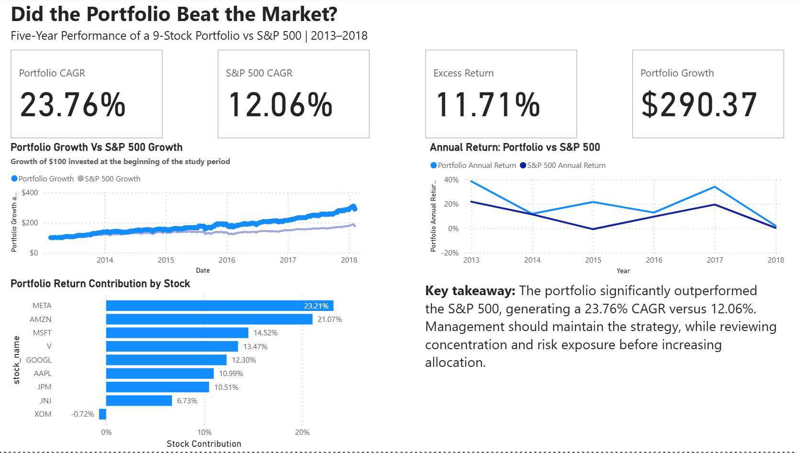
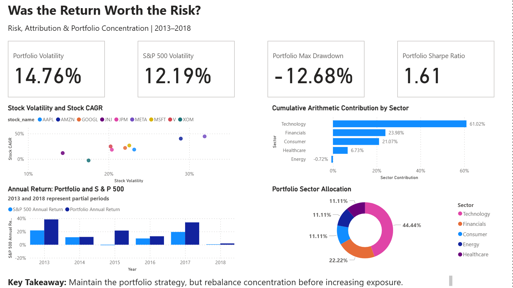

# Investment Portfolio Performance & Risk Analysis

### A Five-Year Historical Study of an Equal-Weight Portfolio vs. the S&P 500

## Project Overview

This project evaluates the historical performance, risk, and drivers of an equal-weight portfolio of nine U.S. stocks against the S&P 500 benchmark over the period **February 8, 2013 to February 7, 2018**.

The analysis was designed from an investment committee perspective to answer a practical question:

> **Did the portfolio generate sufficient additional return to justify the risk taken?**

The analysis combines **MySQL** for data preparation and analytical calculations with **Power BI** for visualization, risk analysis, performance attribution, and executive storytelling.

---

## Business Problem

An investment committee needs to determine whether the portfolio strategy should be maintained, increased, or adjusted.

The analysis focuses on:

- Whether the portfolio outperformed the S&P 500
- The magnitude of the outperformance
- Whether the additional return justified the risk
- Which stocks drove portfolio performance
- Which sectors drove performance
- How concentrated the portfolio was
- What management should consider going forward

---

## Business Questions

1. Did the portfolio outperform the S&P 500?
2. By how much did it outperform the benchmark?
3. Was the return worth the risk taken?
4. Which stocks were the main drivers of performance?
5. Which sectors contributed most to portfolio performance?
6. How concentrated was the portfolio?

---

## Executive Summary

| Metric | Portfolio | S&P 500 |
|---|---:|---:|
| Cumulative Return | 190.37% | 76.67% |
| CAGR | 23.76% | 12.06% |
| Annualized Volatility | 14.76% | 12.19% |
| Maximum Drawdown | -12.68% | -14.16% |
| Sharpe Ratio | 1.61 | — |
| $100 Growth | $290.37 | — |

The portfolio generated a **23.76% CAGR versus 12.06% for the S&P 500**, producing approximately **11.70 percentage points of annualized excess return**.

Over the full study period, the portfolio generated **113.70 percentage points of cumulative excess return** relative to the benchmark.

The portfolio experienced higher day-to-day volatility than the S&P 500, but its maximum peak-to-trough decline was smaller during the study period.

### Executive Conclusion

The results support **maintaining the portfolio strategy**, while reviewing its concentration and risk exposure before increasing allocation.

The strong performance was heavily supported by a small number of high-performing stocks, particularly **META and AMZN**, while the portfolio also had a **44.4% technology allocation**.

---

## Portfolio & Dataset

The portfolio contains nine U.S. stocks with an equal weight of approximately **11.11% each**.

| Stock | Sector | Portfolio Weight |
|---|---|---:|
| AAPL | Technology | 11.1% |
| AMZN | Consumer | 11.1% |
| GOOGL | Technology | 11.1% |
| JNJ | Healthcare | 11.1% |
| JPM | Financials | 11.1% |
| META | Technology | 11.1% |
| MSFT | Technology | 11.1% |
| V | Financials | 11.1% |
| XOM | Energy | 11.1% |

### Sector Allocation

- Technology: 44.4%
- Financials: 22.2%
- Consumer: 11.1%
- Healthcare: 11.1%
- Energy: 11.1%

### Dataset Scope

- 11,331 observations
- 9 stocks
- 1,259 observations per stock
- February 8, 2013 – February 7, 2018
- Daily stock price and trading volume data

---

## Data Preparation

The raw stock data was prepared using MySQL.

Key preparation steps included:

1. Converting trading dates into the correct date format.
2. Validating the number of stocks and trading observations.
3. Using `LAG()` to retrieve the previous trading day's closing price.
4. Calculating daily stock returns using:

**Daily Return = (Today's Close − Previous Close) / Previous Close**

5. Keeping the first observation for each stock as `NULL` because no previous trading-day price exists.
6. Aligning benchmark returns with the portfolio analysis.

---

## Data Model

The Power BI model contains:

- `stock_returns`
- `benchmark_returns`
- `DimDate`

`DimDate` provides the date dimension for time-based analysis and connects to both return tables.

---

## SQL Analysis

MySQL was used for:

- Data preparation
- Daily return calculations
- Window-function analysis
- Portfolio return calculations
- Benchmark comparison
- Stock-level performance analysis
- Return and risk calculations

The portfolio daily return was calculated as the equal-weighted average of the nine individual stock returns.

Each stock therefore received a weight of:

**1 / 9 = 11.11%**

---

## Power BI Analysis

The Power BI dashboard contains two executive-focused pages.

### Page 1 — Did the Portfolio Beat the Market?

This page focuses on **what happened**.

It presents:

- Portfolio CAGR
- S&P 500 CAGR
- Excess return
- $100 portfolio growth
- Portfolio vs. benchmark growth
- Annual return comparison
- Stock-level performance contribution
- Executive takeaway and recommendation

### Page 2 — Was the Return Worth the Risk?

This page focuses on **why it happened and what risk was taken**.

It presents:

- Portfolio volatility
- S&P 500 volatility
- Maximum drawdown
- Sharpe ratio
- Risk-return relationship
- Sector allocation
- Sector contribution
- Stock-level risk and return
- Management recommendation

---

## Key Performance Findings

The portfolio substantially outperformed the S&P 500.

- Portfolio CAGR: **23.76%**
- S&P 500 CAGR: **12.06%**
- Annualized excess return: **11.70 percentage points**
- Portfolio cumulative return: **190.37%**
- S&P 500 cumulative return: **76.67%**

A hypothetical **$100 investment grew to $290.37** based on the portfolio's cumulative return over the study period.

The portfolio also outperformed the S&P 500 in most observed annual periods.

In 2014, performance was relatively close, with the portfolio returning approximately **11.8%** versus **11.4%** for the S&P 500.

---

## Risk Analysis

The portfolio delivered substantially higher returns while taking somewhat higher day-to-day volatility.

| Risk Metric | Portfolio | S&P 500 |
|---|---:|---:|
| Annualized Volatility | 14.76% | 12.19% |
| Maximum Drawdown | -12.68% | -14.16% |
| Sharpe Ratio | 1.61 | — |

The portfolio had **higher overall volatility but experienced a smaller worst peak-to-trough decline during the study period**.

The Sharpe ratio of **1.61** indicates strong return relative to the portfolio's volatility during the study period.

---

## Stock-Level Performance

| Stock | Cumulative Return | CAGR | Annualized Volatility |
|---|---:|---:|---:|
| META | 531.21% | 44.56% | 31.89% |
| AMZN | 440.86% | 40.16% | 28.94% |
| MSFT | 225.26% | 26.60% | 22.55% |
| V | 203.30% | 24.85% | 20.23% |
| GOOGL | 168.50% | 21.84% | 22.02% |
| AAPL | 135.12% | 18.65% | 23.16% |
| JPM | 132.10% | 18.34% | 20.38% |
| JNJ | 74.11% | 11.73% | 14.29% |
| XOM | -13.17% | -2.79% | 17.50% |

META produced the strongest return but also had the highest volatility.

AMZN was the second-largest performer, while XOM was the only stock with a negative CAGR.

---

## Performance Contribution

Based on cumulative arithmetic contribution using the portfolio's equal weights:

| Stock | Contribution |
|---|---:|
| META | 23.21% |
| AMZN | 21.07% |
| MSFT | 14.52% |
| V | 13.47% |
| GOOGL | 12.30% |
| AAPL | 10.99% |
| JPM | 10.51% |
| JNJ | 6.73% |
| XOM | -0.72% |

META and AMZN together represented approximately **44.27%** of cumulative arithmetic portfolio contribution.

META, AMZN, and MSFT together represented approximately **58.79%**.

XOM was the only negative contributor.

**Important analytical note:** these figures represent cumulative arithmetic contribution and should not be interpreted as an exact decomposition of the portfolio's compounded 190.37% return.

---

## Sector Analysis

The portfolio had significant exposure to Technology.

### Sector Allocation

- Technology: **44.4%**
- Financials: **22.2%**
- Consumer: **11.1%**
- Healthcare: **11.1%**
- Energy: **11.1%**

The technology allocation reflects the presence of AAPL, GOOGL, META, and MSFT.

This concentration should be monitored because strong portfolio performance was supported by several technology-related holdings.

---

## Management Recommendations

### 1. Maintain the portfolio strategy

The portfolio substantially outperformed the S&P 500, generating a 23.76% CAGR versus 12.06%.

The evidence therefore supports maintaining the strategy rather than replacing it.

### 2. Review concentration before increasing allocation

Performance was heavily supported by a small number of stocks, particularly META and AMZN, while Technology represented 44.4% of the portfolio.

Management should evaluate whether this concentration is consistent with the investment mandate and risk tolerance.

### 3. Consider diversification or rebalancing

If the investment mandate prioritizes reducing concentration risk, management could evaluate whether rebalancing across sectors would improve diversification without materially weakening the portfolio's return potential.

### 4. Continue monitoring risk-adjusted performance

The portfolio's higher volatility should be monitored alongside its return advantage.

Future reviews should track volatility, maximum drawdown, Sharpe ratio, and performance relative to the benchmark.

---

## Dashboard

### Executive Overview



### Risk & Attribution



---

## Tools

- **MySQL** — data preparation and analytical SQL
- **Power BI** — dashboard development and visualization
- **DAX** — portfolio, benchmark, risk, and performance measures

---

## Project Structure

```text
investment-portfolio-analysis/
│
├── README.md
├── data/
│   └── stocks.csv
│
├── sql/
│   ├── data_preparation.sql
│   ├── portfolio_analysis.sql
│   └── benchmark_analysis.sql
│
├── powerbi/
│   └── investment_portfolio_dashboard.pbix
│
└── images/
    ├── executive-overview.png
    └── risk-attribution.png
